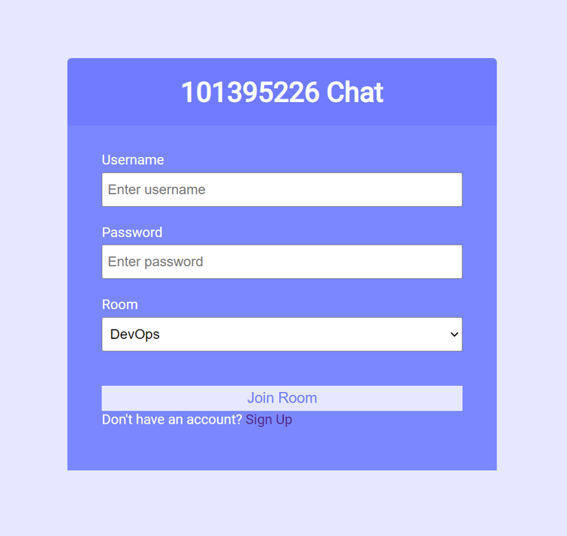

# Chat App
This is a simple chat application built using Node.js, Express.js, Socket.io, and MongoDB. Users can sign up, log in, join chat rooms, and send messages to other users in real-time.

## Technology Used
- Node.js
- Express.js
- Socket.io
- MongoDB
- Mongoose